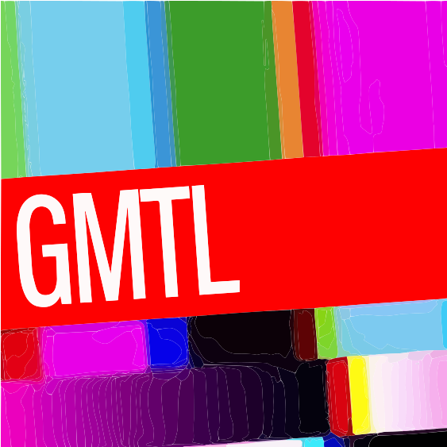

<p align="center">
  
</p>

<h1 align="center">gksrmf</h1>

<p align="center">
  <strong>物理キーをハングルに変換</strong><br/>
  Windows に韓国語キーボードレイアウトがなくても、英字キーボードの二重式（두벌식）でハングルを入力できます。
</p>

<p align="center">
  
  
  
</p>

<p align="center">
  <a href="#-機能">機能</a>
  ·
  <a href="#-使い方">使い方</a>
  ·
  <a href="#-ビルド">ビルド</a>
  ·
  <a href="#-ドキュメント">ドキュメント</a>
</p>

---

## プレビュー

<p align="center">
  
</p>

<p align="center">
  <sub>トレイ・ウィンドウタイトルに表示されるアプリアイコン · 韓国語レイアウトがなくても物理キーで二重式ハングルを組み合わせる Win32 トレイアプリ</sub>
</p>

---

## 概要

**gksrmf** は GMTL が開発した軽量 Windows ネイティブアプリです。

韓国語キーボードがインストールされていない PC でも、QWERTY キーボードで `gksrmf` と入力すると `한글`（ハングル）が表示されます。WebView や巨大ランタイムを使わず、Rust + Win32 で動作し、実行ファイル単体でポータブルに使えることを目指しています。

| 項目 | 内容 |
|---|---|
| プロジェクト名 | gksrmf |
| サービス名 | 物理キーをハングルに変換 |
| 対象ユーザー | 韓国語キーボードレイアウトがない Windows ユーザー |
| プラットフォーム | Windows 10/11 (Win32) |

---

## 機能

| 機能 | 説明 |
|---|---|
| **リアルタイムハングル組み合わせ** | `WM_KEYDOWN` 物理キー → 二重式ハングル完成形へ変換 |
| **한/영 モード切替** | ステータスバーの `[한] \| 영` クリックまたは **F1** |
| **常に前面** | ステータスバーのチェックボックスまたはトレイメニュー |
| **トレイ常駐** | タスクバーに表示せず、トレイアイコンで常駐 |
| **設定の保存** | ウィンドウ位置・サイズ、常に前面、起動時自動実行 (`config.json`) |
| **内蔵ハングルフォント** | Noto Sans CJK KR — ハングルフォントがない環境でも表示をサポート |
| **Unicode コピー** | Windows 標準クリップボード (`CF_UNICODETEXT`) で他アプリへ貼り付け |

---

## 使い方

1. アプリを起動すると入力ウィンドウが開きます。
2. デフォルトは **ハングルモード** です。英字キーボードで入力すると二重式ハングルが組み合わされます。
3. **英字入力** が必要な場合は、ステータスバーの `한 | [영]` をクリックするか **F1** を押します。
4. ウィンドウを閉じても終了せず、トレイに残ります。トレイアイコンを **ダブルクリック** すると再表示されます。
5. トレイ **右クリック** メニュー: 常に前面、Windows 起動時に実行、終了。

### 入力例

| キー入力 | 結果 |
|---|---|
| `gksrmf` | `한글` |
| `dkssud` | `안녕` |

---

## ダウンロード

**[GitHub Releases](https://github.com/noelfania/gksrmf/releases)** から最新版を取得できます。

1. Releases ページを開く
2. 最新の `v*` タグを選ぶ
3. `gksrmf.exe` または `gksrmf-v*-win64.zip` をダウンロード
4. 解凍後（zip の場合）、`gksrmf.exe` を実行

初回実行時、exe と同じフォルダに `config.json` が作成されます。

### リリースの作り方（開発者向け）

タグを push すると GitHub Actions が自動でビルドし、Releases に exe を添付します。

```bash
git tag v0.1.0
git push origin v0.1.0
```

`Cargo.toml` の `version` とタグ（`v0.1.0`）は揃えてください。

---

## ビルド

### 要件

- [Rust](https://www.rust-lang.org/) (edition 2021)
- Windows 10/11 SDK (Win32 ビルド環境)

### インストールとビルド

```bash
# Rust インストール (Windows)
winget install Rustlang.Rustup

# 確認
rustc --version
cargo --version

# 開発ビルド
cargo build

# リリースビルド (推奨)
cargo build --release

# テスト
cargo test
```

ソースからビルドする場合の出力: `target/release/gksrmf.exe`  
一般ユーザーは上記 [ダウンロード](#ダウンロード) の Releases を利用してください。

---

## ドキュメント

| ドキュメント | 説明 |
|---|---|
| [サービス仕様](.cursor/rules/project-standards.mdc) | 目的、範囲、機能概要、モジュール構成 |
| [詳細設計](doc/app-detailed-design.md) | モジュール構造、入力モデル、UI 仕様 |
| [開発イシュー整理](doc/issues/issues.md) | 検討・解決・保留・未確認項目 |

---

## 技術スタック

- **言語**: Rust
- **UI**: Win32 API (`EDIT`、トレイ、ネイティブウィンドウ)
- **ハングルエンジン**: `src/hangul_engine.rs` — 二重式物理キー組み合わせ
- **設定**: `serde` + JSON
- **フォント**: Noto Sans CJK KR ([OFL](assets/fonts/OFL.txt))

---

## チーム

<p align="center">
  
</p>

<p align="center">
  <strong>GMTL</strong> · noelfania
</p>
